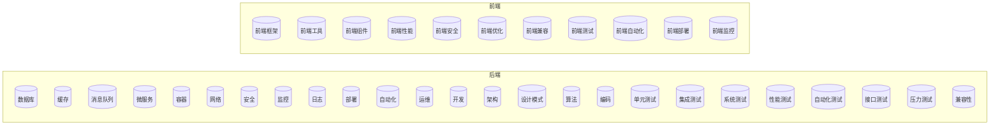

## 🌟 你好! 我是 hg

👋 一名热爱编程的程序员，正在进行永无止境的学习之旅...

- 🌱 目前，我正在学习 [Python](https://github.com/hgfc6/study/blob/main/python/python.md) 和 [前端](https://github.com/hgfc6/study/tree/main/front)
- 👯 我正在寻找**有想法**的团队，没有什么比汇集大家的智慧并创造真正有价值的东西更有成就感的了！
- 📫 想要联系我？您可以通过 `cjh789987@163.com` 与我联系。无论是岗位需求、项目创意、技术问题，还是只是打个招呼，我都会及时回复！

## 技能展示

| 语言         | 数据库           | 中间件       | 框架       | 工具         | 其他      |
|------------|---------------|-----------|----------|------------|---------|
| Java       | MySQL         | Kafka     | Spring * | Git        | Jenkins |
| Golang     | MongoDB       | Nginx     | Gin      | Maven      | OAuth2  |
| Python     | Redis         | RabbitMQ  | Gorm     | Kubernetes | JWT     |
| HTML/CSS   | Elasticsearch | Mybatis   | go-zero  |            |         |
| JavaScript | PostgreSQL    | Tomcat    | Vue      |            |         |
| SQL        | SQLite        | Zookeeper | React    |            |         |
| Rust       | influxdb      |           | Django   |            |         |
|            | Etcd          |           |          |            |         |

## 脑图
